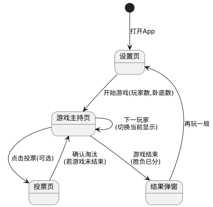
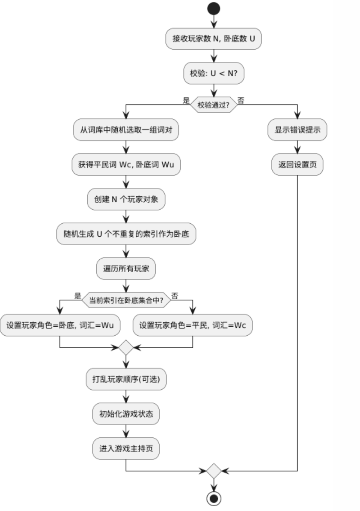
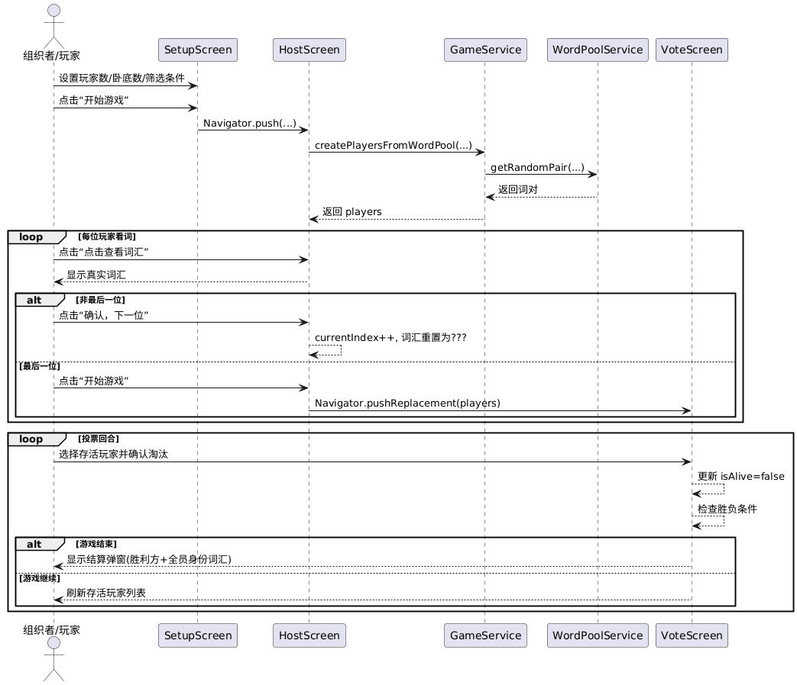

# 谁是卧底助手 开发文档（与当前实现同步）

**版本**：v1.0.2  
**最后更新**：2026-02-20  
**状态**：开发中（已按现代码同步）

---

## 1. 当前实现概览

### 1.1 项目背景
这是一款线下聚会用的“谁是卧底”辅助工具。应用负责完成词库抽取、身份分配、逐人看词、投票淘汰与胜负结算。

### 1.2 已实现功能（按代码现状）

| 优先级 | 功能点 | 当前实现状态 |
|--------|--------|--------------|
| **P0** | 游戏设置 | ✅ 通过加减按钮设置玩家数和卧底数 |
| **P0** | 词库加载 | ✅ 优先读取 `assets/wordbanks/index.json`；失败时回退 `assets/word_pairs.json` |
| **P0** | 分类与难度筛选 | ✅ 设置页可读取启用分类；可开关“按难度筛选” |
| **P0** | 身份与词汇分配 | ✅ 随机词对 + 随机卧底索引 |
| **P0** | 逐人看词流程 | ✅ 主持页逐位展示，默认隐藏词汇，点击后显示并进入下一位 |
| **P1** | 投票淘汰 | ✅ 投票页按存活玩家单选淘汰，带二次确认 |
| **P1** | 胜负判定与结算 | ✅ 自动判定并弹窗展示全员身份/词汇/存活状态 |
| **P1** | 忘词回看 | ✅ 投票页可选存活玩家回看词汇 |

### 1.3 业务规则（当前实现）
- 玩家数联动约束：`minPlayers = undercoverNum * 2 + 1`。
- 全局玩家上限：`12`。
- 卧底数下限：`1`；上限：`ceil(playerNum / 2) - 1`。
- `GameService` 校验：`undercoverCount` 必须在 `1..playerCount-1`。
- 胜负条件：
  - 存活卧底数为 `0`：平民胜利。
  - 存活平民数 `<=` 存活卧底数：卧底胜利。

---

## 2. 技术设计（当前实现）

### 2.1 技术栈
- Flutter（Material）
- 路由：`MaterialApp + Navigator`
- 状态管理：页面内 `StatefulWidget + setState`
- 词库：本地 JSON（assets）

> 说明：当前代码未接入 `provider` / `riverpod` / `go_router` / `shared_preferences`。

### 2.2 代码结构（实际存在）
```text
lib/
├── main.dart
├── models/
│   └── game_models.dart
├── screens/
│   ├── setup_screen.dart
│   ├── host_screen.dart
│   └── vote_screen.dart
└── services/
    ├── game_service.dart
    └── word_pool_service.dart
```

### 2.3 数据模型
```dart
enum GameRole { civilian, undercover }

class Player {
  final int id;
  final String name;
  final GameRole role;
  final String word;
  bool isAlive;

  Player copy();
}
```

> 说明：当前代码中没有 `Game` 聚合对象与 `GameStatus` 枚举，游戏流程由各页面状态直接驱动。

### 2.4 词库与分配逻辑
1. `WordPoolService.loadWordBankOptions()` 读取 `assets/wordbanks/index.json`。
2. 若分词库可用，合并所有 `enabled` 文件并去重词对；否则回退旧格式 `assets/word_pairs.json`。
3. `GameService.createPlayersFromWordPool()`：
   - 随机取一组词对；
   - 生成 `playerCount` 个平民；
   - 随机挑选 `undercoverCount` 个索引替换为卧底词。

---

## 3. UI/UX（按当前页面行为）

### 3.1 设置页（`SetupScreen`）
- AppBar 标题：`游戏设置`。
- 卡片内容：项目标题、词库加载状态、启用分类提示。
- 难度筛选：`Switch + ChoiceChip`，开启后仅使用选定难度。
- 玩家数/卧底数：使用加减按钮计数器（非文本输入）。
- 底部固定按钮：`开始游戏`，进入 `HostScreen`。

### 3.2 主持页（`HostScreen`）
- AppBar 标题：`查看词汇`。
- 初始状态：异步加载玩家；失败时显示错误和 `重试`。
- 主流程：
  1. 显示“当前玩家：玩家X”；
  2. 词汇区域默认显示 `???`；
  3. 点击 `点击查看词汇` 后显示真实词；
  4. 点击 `确认，下一位` 进入下一位，并再次隐藏词汇；
  5. 最后一位按钮变为 `开始游戏`，进入 `VoteScreen`。
- 当已到最后且继续下一位时，会提示：`所有玩家都已查看词汇`。

> 说明：当前主持页不显示身份标签、不显示存活人数、不可直接淘汰玩家；淘汰逻辑在投票页。

### 3.3 投票页（`VoteScreen`）
- AppBar 标题：`投票淘汰`，右上角提供 `忘词回看`。
- 主体为存活玩家单选列表（已淘汰玩家不显示）。
- 点击 `淘汰选中玩家` 会二次确认，再更新 `isAlive`。
- 触发胜负后弹出结算：
  - 显示胜利方；
  - 展示所有玩家身份、词汇、存活状态；
  - 支持 `返回首页` / `再来一局`。

### 3.4 UML 图（已同步）
- 状态图：
- 活动图：
- 时序图：

---

## 4. 开发与测试指南（同步版）

### 4.1 环境配置
- Flutter SDK: `>=3.16.0`
- Dart SDK: `^3.11.0`
- IDE: Trae / VS Code

### 4.2 当前依赖（以 `pubspec.yaml` 为准）
```yaml
dependencies:
  flutter:
    sdk: flutter
  cupertino_icons: ^1.0.8
  google_fonts: ^6.3.2

dev_dependencies:
  flutter_test:
    sdk: flutter
  flutter_lints: ^6.0.0
  flutter_launcher_icons: ^0.14.4
```

### 4.3 推荐测试点

| 编号 | 场景 | 输入 | 预期 |
|------|------|------|------|
| TC01 | 正常开局 | 玩家8，卧底2 | 成功进入主持页，逐位可查看词汇 |
| TC02 | 参数联动下限 | 卧底2时调玩家数 | 玩家最小值自动变为5 |
| TC03 | 词库筛选 | 开启难度筛选并选难度 | 可正常开局，词对来自对应难度 |
| TC04 | 主持页流程 | 点击查看词汇后下一位 | 下一位词汇重新隐藏为 `???` |
| TC05 | 卧底胜利 | 存活平民数<=存活卧底数 | 弹出“卧底胜利！”结算框 |
| TC06 | 平民胜利 | 所有卧底被淘汰 | 弹出“平民胜利！”结算框 |
| TC07 | 忘词回看 | 投票页点击忘词回看 | 仅可选存活玩家并查看其词汇 |

### 4.4 构建命令
- Android：`flutter build apk --release`
- iOS：`flutter build ios --release`（需 Xcode）

---

## 5. 已知差异与后续发展
- `再来一局` 当前会按人数重开，但不会继承上局分类/难度筛选。
- `Player.id` 当前从 `0` 开始生成；UI 展示名称为“玩家1..N”，不影响玩法，但如需对外统一可在后续调整为 `1..N`。
